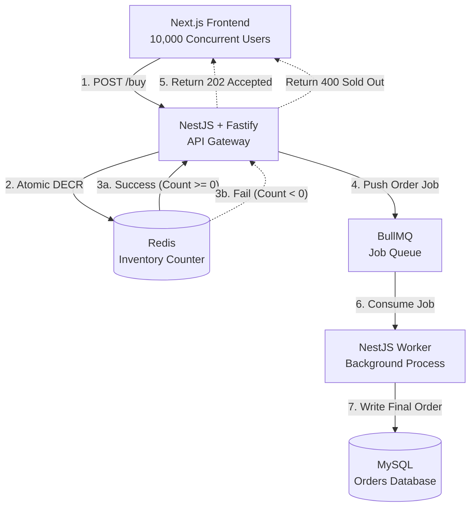

## High-Concurrency "Flash Sale" Engine**

9001 React 
9002 Nest 

**Description**
A high-throughput, distributed inventory system designed to handle massive, instantaneous spikes in web traffic (a "thundering herd") for limited-stock events like sneaker drops or concert ticket sales. The system reliably processes thousands of concurrent purchase requests, guarantees zero overselling through atomic in-memory operations, and processes finalized orders asynchronously to protect the primary database from crashing under load.

---

### **The Tech Stack (100% Local & Open-Source)**

* **Frontend:** **Next.js (React)** * Provides a fast, responsive user interface for users to hit the "Buy" button and receive real-time queue updates.
* **API Gateway / Backend:** **NestJS with Fastify Adapter**
    * Replaces the default Express engine with Fastify to maximize Requests Per Second (RPS) and minimize JSON serialization overhead during traffic spikes.
* **In-Memory Datastore & Locking:** **Redis**
    * Acts as the absolute source of truth for live inventory. Uses atomic operations (like `DECR`) to instantly grant or reject access to an item without querying the database.
* **Asynchronous Message Queue:** **BullMQ (via NestJS)**
    * Runs on top of Redis. Captures successful inventory claims and queues them for background processing, decoupling the fast user response from the slow database write.
* **Primary Database:** **MySQL**
    * The persistent, ACID-compliant source of truth for user profiles and finalized, completed orders.
* **Infrastructure:** **Docker**
    * Used to containerize Redis, MySQL, and the backend workers so the entire distributed system can be spun up locally by any recruiter or engineer with a single `docker-compose up` command.

---

### **The Problem We Are Solving**

**The "Race Condition" and Database Bottleneck**
In a traditional CRUD application, when a user buys an item, the server asks the database: *"How many items are left?"* If the database says "1", the server subtracts 1 and saves "0". 

However, if 10,000 people ask that exact same question at the exact same millisecond, the database will tell *all of them* that there is 1 item left. The system will process 10,000 orders for a single item (overselling), and the database will likely lock up and crash due to connection limits. 

**The Solution:**
We solve this by completely shielding the MySQL database from the initial traffic surge. We offload the concurrency problem to Redis (which operates in RAM and handles hundreds of thousands of operations per second) and use a message queue to drip-feed the actual database writes at a safe, controlled pace.

---

### **Calculation of Metrics (Load & Throughput)**

To prove this architecture works, you will load-test it against these specific metrics:

* **The Inventory Constraint:** 100 limited-edition items available.
* **The Traffic Surge:** 10,000 concurrent users attempting to purchase at exactly the same time.
* **Target Throughput:** The Fastify/NestJS API must successfully ingest and route **1,000+ Requests Per Second (RPS)** without dropping connections.
* **Success Metrics:** * **0% Oversell Rate:** The system must sell exactly 100 items. Not 99, not 101.
    * **Fast Failure:** The remaining 9,900 users must receive a `400 Bad Request` ("Sold Out") response in under 50 milliseconds.
    * **Database Stability:** MySQL CPU usage should remain completely stable, as it will only process a steady stream of 100 asynchronous worker jobs, completely unaware of the 10,000 requests that hit the edge server. 
---

## System Architecture

Here is how the data flows through our high-concurrency system:

---
## ⚠️ Critical Weak Point
* Redis is a Single Point of Failure (SPOF). The entire system — both the inventory counter and the BullMQ job queue — runs on Redis. If Redis goes down mid-sale, you lose both the lock mechanism and pending order jobs. A production-grade solution would require Redis Sentinel or Redis Cluster for high availability, and potentially a dead-letter queue strategy to recover unprocessed jobs. This is the #1 thing to address before calling this production-ready.
